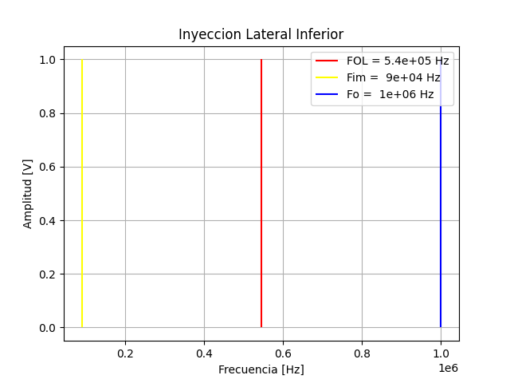

# Especificaciones

Escribir un programa que:

- Permita a el usuario elegir una frecuencia a sintonizar.

- Grafique en un espectro de frecuencias la `frecuencia del oscilador local`, `frecuencia imagen` y la `frecuencia sintonizada`.
    
- El programa en ningún momento debe preguntar o tener establecido que el oscilador lateral superior o inferior, debe elegirlo de manera aleatoria.
    
- Debe aparecer una etiqueta para cada frecuencia que se grafique. Cada una debe tener un color distinto.
    
- El título del gráfico debe variar de acuerdo a el tipo de oscilador.

El resultado debe ser algo parecido a esto:




Luego armar un `README.md` con este formato:

```markdown
# Superheterodino - Mezclador

Alumno: Apellido y nombre
Curso: Curso
Materia: Telecomunicaciones II

# Inyección Lateral Inferior

[Gráfico que corresponda]

# Inyección Lateral Superior

[Gráfico que corresponda]

```

## Consideraciones

- Pueden usar la función `choice` del módulo `random` para que elija aleatoriamente entre una inyección u otra. Pueden ver información en esta [página](https://www.w3schools.com/python/ref_random_choice.asp).
- Las amplitudes de las frecuencias pueden ser de cualquier valor, pero todas deben tener el mismo.
- Para dibujar lineas verticales, pueden usar `plt.vlines()`. Pueden ver como se usa en la documentación de [matplotlib](https://matplotlib.org/stable/api/_as_gen/matplotlib.pyplot.vlines.html).
- Los títulos y los ejes los pueden cambiar con `plt.title()`, `plt.xlabel()` y `plt.ylabel()`.

## Como entregar


Pongan el `README.md`, `mezclador.py` y las imagenes que tomaron dentro de una nueva carpeta y corran en una terminal:

```
git init
git add .
git commit -m "Initial commit"
git checkout -b teleco2/2021/superheterodino/mezclador
git push https://github.com/trq20/USERNAME.git teleco2/2021/superheterodino/mezclador
```

Donde `USERNAME` es su nombre de usuario. Pueden verificar que se haya subido visitando `https://github.com/trq20/USERNAME/treee/teleco2/2021/superheterodino/mezclador`.
